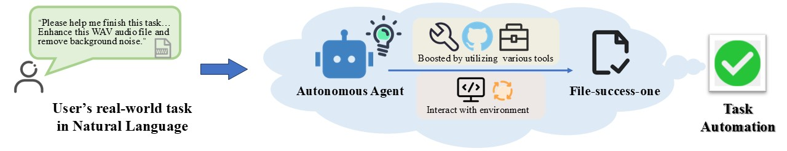
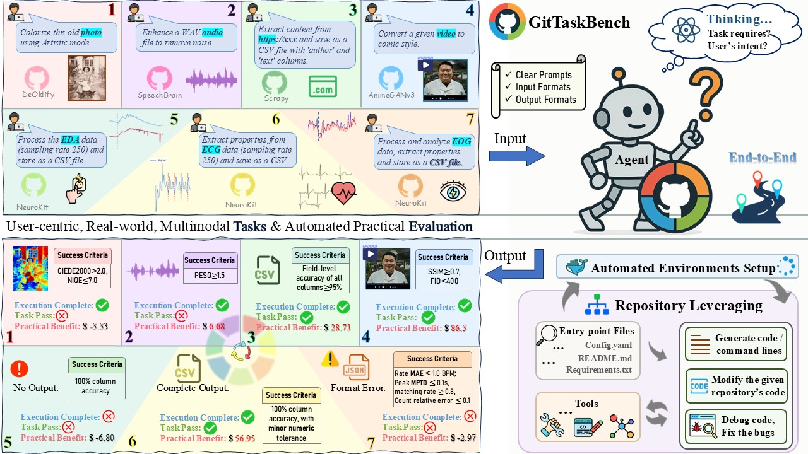
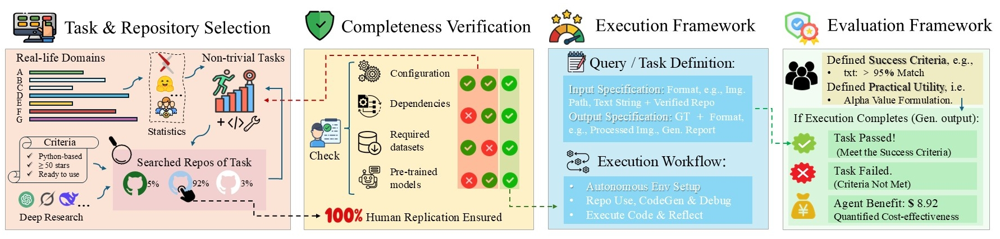
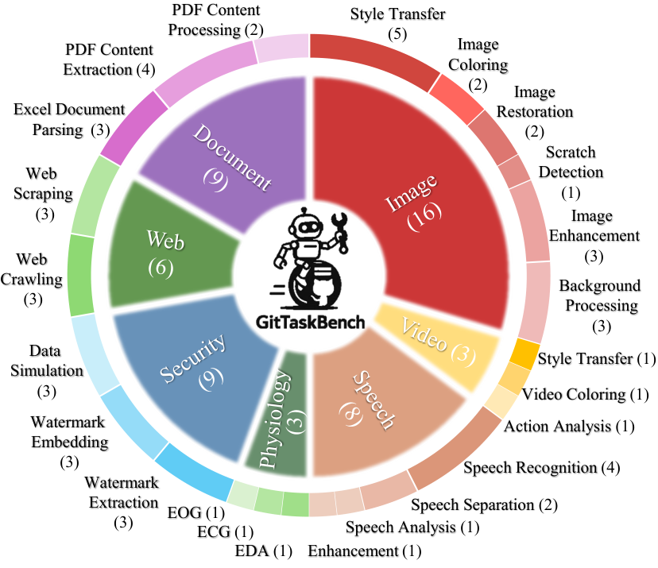
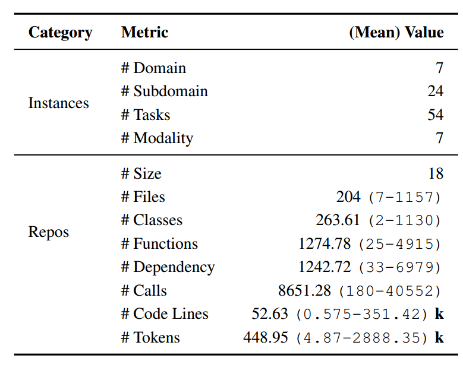
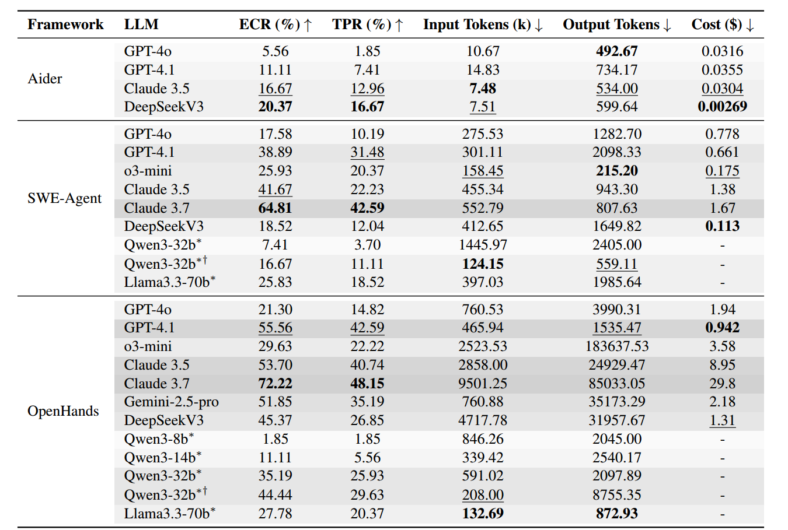

<div align="center">
  <h1 align="center" style="color: #2196F3; font-size: 24px; font-weight: 600; margin: 20px 0; line-height: 1.4;">
    🚀 GitTaskBench: <span style="color: #555; font-weight: 400; font-size: 18px;"><em>A Benchmark for Code Agents Solving Real-World Tasks Through Code Repository Leveraging</em></span>
  </h1>
  
  <p style="margin: 20px 0;">
    <a href="https://arxiv.org/abs/2508.18993"></a>
    <a href="#"></a>
    <a href="#"></a>
  </p>
  
</div>

## 🧭 Motivation and Goal
The ultimate vision for AI agents is to enable users to accomplish real-world tasks simply by describing their needs in natural language—leaving all planning and execution to the agent, which delivers the final results autonomously. 

<p align="center">
  <br>
</p>

⚠️ While existing benchmarks evaluate various agent capabilities, few focus on tasks that reflect genuine real-world practicality, especially those requiring comprehensive understanding and use of full-scale project repositories.

👋 To address this gap, we introduce **GitTaskBench**. Our benchmark focuses on tasks whose complexity and practical value demand leveraging repository-level code, mirroring how developers solve real problems using existing GitHub projects. 


<p align="center">
  <br>
   <em>Overview of GitTaskBench. 7 example real-life tasks from different modalities and their evaluations are shown. </em>
</p>

🔍 We carefully selected **54 representative tasks** with real-world economic value, and for each task, searched and identified a corresponding GitHub repository that meets strict selection criteria (the repository for each task is fixed to ensure benchmark completeness, as some agent frameworks do not support searching for appropriate repositories). This setup allows us to systematically evaluate LLM agents' ability to utilize open-source repositories to solve complex, realistic problems.

👉 By doing so, ***GitTaskBench offers a more authentic and comprehensive assessment of agent performance in practical, repository-driven environments***.


## 🚀 How to Run

⚡ If you only want to know how to use GitTaskBench, start here.

### 1. Set Up ⚙️ 
GitTaskBench offers easy-to-use shell commands to ensure reproducible evaluations. To build GitTaskBench from source, follow bellow steps. 

First, create a new conda environment:
```console
conda create -n gittaskbench python=3.10 -y
conda activate gittaskbench

pip install torch==1.11.0+cu113 torchvision==0.12.0+cu113 torchaudio==0.11.0 \
  --extra-index-url https://download.pytorch.org/whl/cu113
```
<a name="set-up"></a>
Then, you can install `gittaskbench` with pip:
```console
git clone https://github.com/your-org/GitTaskBench.git
cd GitTaskBench
# config
pip install -e .
```
also you can
```console
# config
pip install -r requirements.txt
```

### 2. Quick Start 💡 

* #### **Single Task Evaluation:**

If you need to evaluate a single, specific task, you can use the following command. The example below shows how to evaluate the `Trafilatura_01`  task:
```console
gittaskbench grade --taskid Trafilatura_01
```

* #### **All Tasks Evaluation**
When you need to evaluate all tasks, you can use the --all parameter. This command will automatically iterate through and execute the evaluation of all tasks:
```console
gittaskbench grade --all
```

* #### **Test Results Analysis**
After completing the evaluation, if you want to analyze the test results, you can use the eval command. This command will analyze the evaluation results in the specified directory and output an analysis report:
```console
gittaskbench eval
```

👉 That’s it. With the above commands you can set up, run, and analyze GitTaskBench.


## 📖 Benchmark Overview
GitTaskBench is a comprehensive benchmark designed to evaluate the capabilities of intelligent agents across multiple modalities and task complexities. It encompasses **54 tasks** spanning **7 key domains**.

Each domain features a curated set of tasks that reflect real-world applications and research challenges. These tasks assess an agent's autonomous ability to interpret complex instructions, process multi-modal inputs, perform reasoning, understand and explore the GitHub repositories, and deliver accurate, meaningful outputs. 

The GitTaskBench data curation and processing pipeline is illustrated below.

<p align="center">
  <br>
     <em>Overview of the GitTaskBench data curation and processing pipeline. </em>
</p>


## ✅ Task Distribution

| Domain                     | Task List                                                                                                                                                                  |
|----------------------------|----------------------------------------------------------------------------------------------------------------------------------------------------------------------------|
| Image Processing           | Style Transfer, Image Coloring, Image Restoration, Scratch Detection, Image Enhancement, Background Processing, Watermark Embedding |
| Video Processing           | Video Action Analysis, Style Transfer, Video Coloring                                                                                                                      |
| Speech Processing          | Speech Recognition, Speech Separation, Speech Enhancement, Noise Reduction, Speech Analysis                                  |
| Physiological Signals Processing    | EDA (Electrodermal Activity) Data Analysis, ECG (Electrocardiogram) Data Analysis, EOG (Electrooculogram) Data Analysis                                                                                             |
| Security and Privacy         | Data Simulation, Watermark Embedding, Watermark Extraction                                                                                             |
| Web Scraping               | Web Content Extraction, Format Transformation                                                                                                                                                              |
| Office Document Processing | Excel Document Parsing, PDF Content Extraction, PDF Content Processing                                                                                                                   |

<div align="center">
  
  <br>
  <em>Task Domains and Summary Statistics.</em>
</div>


## 🛠️ Integrating with Agent Frameworks

We provide detailed configuration guidelines on how to integrate **GitTaskBench** with existing state-of-the-art general-purpose agent frameworks, including **OpenHands**, **SWE-Agent** and **Aider**. This enables users to seamlessly run batches of benchmark tasks within their agent pipelines.

*In fact, the batch runner we provide—designed to enable efficient execution of multiple tasks—**is not limited to GitTaskBench**, and can be broadly applied to other benchmarks and agent-based task suites as well.*

👉 Configuration details for each agent framework are provided in the following files:

- For **OpenHands**, see:
  -  [OpenHands Configuration Guide](./OpenHands/run_batch_README.md)
    ```console
  cd OpenHands
    poetry run python run_batch.py
  ```
- For **SWE-Agent**, see: 
  - [SWE-Agent Configuration Guide 1](./SWE_agent/README_batch_add.md)
  - [SWE-Agent Configuration Guide 2](./SWE_agent/README_batch_improvements.md)
  ```console
  cd SWE_agent
  bash run_batch.sh
  ```
- For **Aider**, directly run:
  ```console
  cd Aider
  bash run_aider_batch_litellm.sh
  ```


## 🤖 Automation Evaluation
After finishing the [🚀 Set Up](#set-up) preparation, you can explore the complete usage of gittaskbench for automatiion evaluation:

```console
gittaskbench [-v] grade --taskid <taskid> [--output_dir <output_dir>] [--result <result>]
```
### 🔧 Options:

- `--taskid <taskid> `: (Required in single task evaluation) The task identifier, e.g., Trafilatura_01.
- `-v `: (Optional) Enable verbose output to display detailed error messages.
- `--output_dir `: (Optional) The directory containing the agent's output files. If not specified, the default value is read from task_info.yaml.
- `--result `:(Optional) The directory containing the agent's test results files. If not specified, the default value is read from task_info.yaml.

```console
gittaskbench eval  [--result <result>]
```
### 🔧 Options:

- `--result `:(Optional) The directory containing the agent's test results files. If not specified, the default value is test_results file in repo.


## 📊 Evaluation Results
GitTaskBench evaluates two key aspects: 

- **Execution Completion Rate**: measures whether the agent can leverage the repository to produce any valid output.

- **Task Pass Rate** : assesses whether the output meets task-specific evaluation criteria. 

Given the diversity of tasks, all evaluation metrics are predefined and tailored to each task, drawing on commonly accepted standards within the developer community. This ensures a comprehensive and fair assessment.

<p align="center">
  <br>
    <em>Performance Comparison of Different Frameworks and LLMs on GitTaskBench.</em>
</p>

Regarding the domain-specific performance,
<p align="center">
  <br>
    <em>Performance Evaluation of GPT-4o, GPT-4.1, Claude 3.5, DeepSeek V3 across Different Task Domains.</em>
</p>


## 📝 Application Cases
<details>
<summary><strong>📄 Case 1: PDF Email Extraction</strong></summary>

<br>

```python
task = """
Extract all email addresses found in the given PDF and save them to a text file.
Input file: /path/to/document.pdf
Output requirement: Save as output.txt
"""

# evaluation metrics = """
# Process: True/False (Data Integrity Check)  
#     -- Confirms prediction file and ground truth file accessibility  
#     -- Validates file parsing success (no read errors)  

# Result: True/False (Performance Threshold)  
#     -- Calculates accuracy: (Correct Emails / Total Ground Truth) ×100%  
#     -- Applies pass criterion: Accuracy ≥98%   
# """
```
</details>

<details>
<summary><strong>🎥 Case 2: Video Coloring</strong></summary>

<br>

```python
task = """
Colorize the provided black-and-white video to produce a fully colored version.
Input file: /path/to/black_and_white_video
Output requirement: Output video is named as "output"
"""

# evaluation metrics = """
# Process: True/False (Technical Validity Verification)  
#     -- Verifies input video file existence and non-empty status  
#     -- Checks format compatibility (.mp4/.avi/.mov/.mkv)  
#     -- Validates frame extraction capability  

# Result: True/False (Color Intensity Threshold)  
#     -- Samples 30 frames with standardized width (256px)  
#     -- Computes per-frame colorfulness via Hasler-Bülthoff metric  
#     -- Aggregates scores to calculate video-level average  
#     -- Pass/Fail determination (Threshold: >10.0 )  
# """
```
</details>

<details>
<summary><strong>🖼️ Case 3: Image Watermark Embedding</strong></summary>

<br>

```python
task = """
Embed a blind (invisible) watermark into the given PNG image.
Input file: /path/to/image.png
Output requirement: Save as output.png
"""

# evaluation metrics = """
#  Process: True/False (Input Validation)  
#     -- Verifies existence and non-empty status of original/watermarked images  
#     -- Checks image file integrity (readable formats via OpenCV)  

# Result: True/False (Watermark & Quality Compliance)  
#     -- Extracts watermark text using DWT-DCT decoding  
#     -- Matches extracted text against ground truth (100% match required)  
#     -- Computes PSNR between original and watermarked images (≥30.0 dB threshold)  
#     -- Final pass requires both watermark match AND PSNR compliance  
# """
```
</details>

## ✨ Key Features:
- **Multi-Modal Support**: Encompasses vision, language, audio, time-series, and web-based data.
- **Diverse Task Types**: Includes generation, recognition, enhancement, analysis, and simulation tasks.
- **Real-World Relevance**: Tasks are derived from practical applications in media, healthcare, automation, and data science.
- **Scalability**: Designed for future expansion with new tasks and evaluation metrics.


## 🤝 Contributing

We welcome community contributions! Please refer to the following guidelines:


### Development Setup

```bash
git clone https://github.com/your-org/GitTaskBench.git
cd GitTaskBench
```
To learn more about automation evaluation, please refer to the [🚀 Set Up](#set-up) section.


### Contribution Types
- 🐛 Bug fixes
- ✨ New feature development
- 📚 Documentation improvements
- 🧪 Test case additions
- 🔧 Repos and utilities

### Submission Process
1. Fork the project and create a feature branch
2. Write code and tests
3. Ensure all tests pass
4. Submit Pull Request

---

## 🌐 About QuantaAlpha

- QuantaAlpha was founded in **April 2025** by a team of professors, postdocs, PhDs, and master's students from **Tsinghua University, Peking University, CAS, CMU, HKUST**, and more.  

🌟 Our mission is to explore the **"quantum"** of intelligence and pioneer the **"alpha"** frontier of agent research — from **CodeAgents** to **self-evolving intelligence**, and further to **financial and cross-domain specialized agents**, we are committed to redefining the boundaries of AI. 

✨ In **2025**, we will continue to produce high-quality research in the following directions:  
- **CodeAgent**: End-to-end autonomous execution of real-world tasks  
- **DeepResearch**: Deep reasoning and retrieval-augmented intelligence  
- **Agentic Reasoning / Agentic RL**: Agent-based reasoning and reinforcement learning  
- **Self-evolution and collaborative learning**: Evolution and coordination of multi-agent systems  

📢 We welcome students and researchers interested in these directions to join us!  

🔗 Team Homepage: [QuantaAlpha](https://quantaalpha.github.io/)

---

<div align="center">

**⭐ If GitTaskBench helps you, please give us a star!**

Made with ❤️ by the GitTaskBench Team


</div> 


